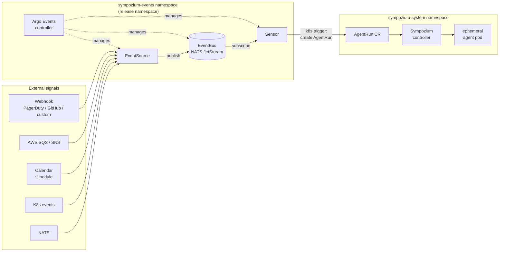

# sympozium-events

[](https://github.com/chrisk700/sympozium-events/actions/workflows/ci.yaml)
[](https://argoproj.github.io/argo-events/)

Argo Events bridge for Sympozium — routes external signals (webhooks, SQS, SNS, schedules, K8s events, NATS) to Sympozium `AgentRun` CRs without any bespoke shim service.



## Install

```bash
helm install my-release \
  oci://ghcr.io/chrisk700/sympozium-events/sympozium-events \
  -f my-values.yaml
```

No `helm repo add` needed.

**[Full documentation →](https://chrisk700.github.io/sympozium-events)**

## Development

**Prerequisites**: `helm` ≥ 3.12, [`helm-unittest`](https://github.com/helm-unittest/helm-unittest) plugin, [`task`](https://taskfile.dev/installation/) ≥ 3.

```
task lint          Update chart dependencies and run helm lint --strict
task test          Run helm-unittest test suite
task test:lint     Lint then test in sequence
task template      Render chart with ci/two-routes.yaml to stdout
task package       Package chart to dist/
task docs:serve    Serve docs locally at http://127.0.0.1:8000
task deps          Check and install local tooling prerequisites
```

**PR workflow**: fork, feature branch, `task test:lint` before pushing. CI runs lint + unittest on every PR and push to `main`. Releases are triggered by pushing a `v*` tag; chart is published to GHCR.

## Links

- [Documentation](https://chrisk700.github.io/sympozium-events)
- [PRD (`design/prd/prd.md`)](design/prd/prd.md)
- [Argo Events documentation](https://argoproj.github.io/argo-events/)
