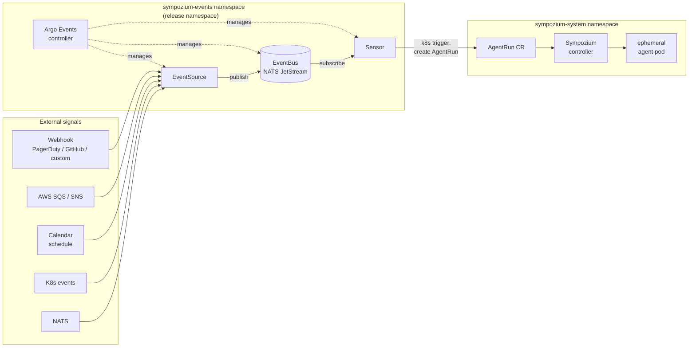

# sympozium-events

Argo Events bridge for Sympozium — routes external signals (webhooks, SQS, SNS, schedules, Kubernetes events, NATS) to Sympozium `AgentRun` CRs without any bespoke shim service.



Each entry in `routes` produces one EventSource and one Sensor. Multiple sources on a route fire with OR logic by default; an AND condition uses Argo Events native dependency conditions.

## Install

```bash
helm install my-release \
  oci://ghcr.io/chrisk700/sympozium-events/sympozium-events \
  -f my-values.yaml
```

No `helm repo add` needed — OCI charts are referenced directly.

→ [Prerequisites](getting-started/prerequisites.md) · [Installation](getting-started/installation.md) · [First route](getting-started/first-route.md)
